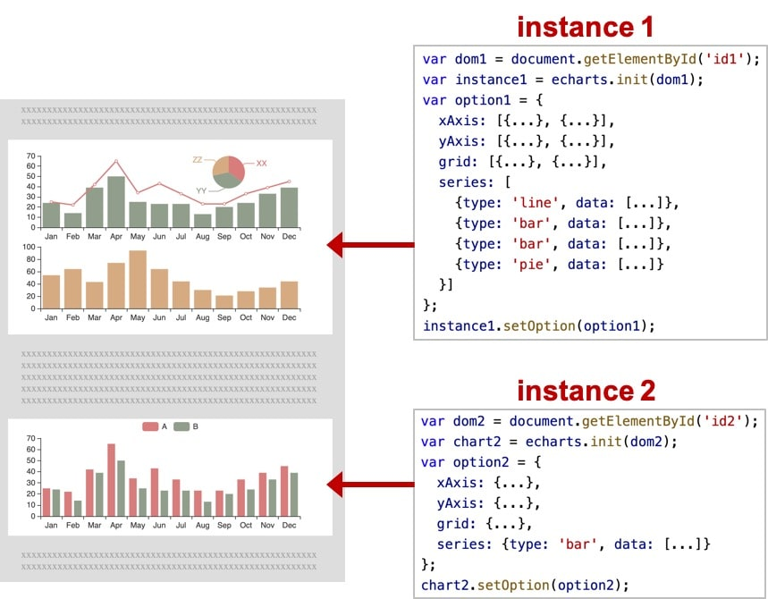

# ECharts 数据可视化 使用教程(图文版)----(2020.02.04, 成都)
## 武汉加油----冲鸭！！！

# 1. 安装使用
- 直接从 [GitHub](https://github.com/apache/incubator-echarts/releases) 下载整个项目文件，然后从echarts-4.6.0/dist 
    文件夹中获取构建好的 echarts，这都可以直接在浏览器端项目中使用。这些构建好的 echarts 提供了下面这几种定制：
- 完全版：echarts/dist/echarts.js，体积最大，包含所有的图表和组件，所包含内容参见：echarts/echarts.all.js。
- 常用版：echarts/dist/echarts.common.js，体积适中，包含常见的图表和组件，所包含内容参见：echarts/echarts.common.js。
- 精简版：echarts/dist/echarts.simple.js，体积较小，仅包含最常用的图表和组件，所包含内容参见：echarts/echarts.simple.js。
- 也可以使用在线引入地址,进入网址选择要引用的版本即可：http://www.bootcdn.cn/echarts/

# 2. ECharts基础概念概览
## 2.1 ECharts实例 
- 一个网页中可以创建多个 echarts 实例。
- 每个 echarts 实例 中可以创建多个图表和坐标系等等（用 option 来描述）。
- 准备一个 DOM 节点（作为 echarts 的渲染容器），就可以在上面创建一个 echarts 实例。
- 每个 echarts 实例独占一个 DOM 节点。
- 参考01文件夹中003案例

## 2.2 系列（series）
- 系列（series）是很常见的名词。
- 在 echarts 里，系列（series）是指：一组数值以及他们映射成的图。
- “系列”这个词原本可能来源于“一系列的数据”，而在 echarts 中取其扩展的概念，不仅表示数据，也表示数据映射成为的图。
- 所以，一个 系列 包含的要素至少有：一组数值、图表类型（series.type）、以及其他的关于这些数据如何映射成图的参数。
- echarts 里系列类型（series.type）就是图表类型。系列类型（series.type）至少有：
    - line（折线图）、bar（柱状图）、pie（饼图）、scatter（散点图）、graph（关系图）、tree（树图）、...
    - 如下图，右侧的 option 中声明了三个 系列（series）：pie（饼图系列）、line（折线图系列）、bar（柱状图系列），
    - 每个系列中有他所需要的数据（series.data）。
    - 
    - 

    
## 2.3 组件（component）
## 注意：图中的{...}里面的...是省略的具体设置参数

- 在系列之上，echarts 中各种内容，被抽象为“组件”。
- 例如，echarts 中至少有这些组件：
    - xAxis（直角坐标系 X 轴）、yAxis（直角坐标系 Y 轴）、
    - grid（直角坐标系底板）、angleAxis（极坐标系角度轴）、
    - radiusAxis（极坐标系半径轴）、polar（极坐标系底板）、
    - geo（地理坐标系）、dataZoom（数据区缩放组件）、
    - visualMap（视觉映射组件）、tooltip（提示框组件）、
    - toolbox（工具栏组件）、series（系列）、...
- 我们注意到，其实系列（series）也是一种组件，可以理解为：系列是专门绘制“图”的组件。
- 如图，右侧的 option 中声明了各个组件（包括系列），各个组件就出现在图中。
- 参考图片 
- 注：因为系列是一种特殊的组件，所以有时候也会出现 “组件和系列” 这样的描述，这种语境下的 “组件” 是指：除了 “系列” 以外的其他组件。
- 组件就是option下的各种设置

## 2.4 option 描述图表
- 上面已经出现了 option 这个概念。echarts 的使用者，使用 option 来描述其对图表的各种需求，
- 包括：有什么数据、要画什么图表、图表长什么样子、含有什么组件、组件能操作什么事情等等。
- 简而言之，option 表述了：数据、数据如何映射成图形、交互行为。
- 
- 

## 2.5 组件定位
- 多数组件和系列，都能够基于 top / right / down / left / width / height 绝对定位。 
- 这种绝对定位的方式，类似于 CSS 的绝对定位（position: absolute）。绝对定位基于的是 echarts 容器 DOM 节点。
- 其中，他们每个值都可以是：
    - 绝对数值（例如 bottom: 54 表示：距离 echarts 容器底边界 54 像素）。
    - 或者基于 echarts 容器高宽的百分比（例如 right: '20%' 表示：距离 echarts 容器右边界的距离是 echarts 容器高度的 20%）。
    - 如下图的例子，对 grid 组件（也就是直角坐标系的底板）设置 left、right、height、bottom 达到的效果。
    - 
- 可以注意到，left right width 是一组（横向）、top bottom height 是另一组（纵向）。这两组没有什么关联。
- 每组中，至多设置两项就可以了，第三项会被自动算出。例如，设置了 left 和 right 就可以了，width 会被自动算出。

- 补充：中心半径定位
    - 少数圆形的组件或系列，可以使用“中心半径定位”，例如，pie（饼图）、sunburst（旭日图）、polar（极坐标系）。
    - 中心半径定位，往往依据 center（中心）、radius（半径）来决定位置。

## 2.6 坐标系
- 很多系列，例如 line（折线图）、bar（柱状图）、scatter（散点图）、heatmap（热力图）等等，需要运行在 “坐标系” 上。
- 坐标系用于布局这些图，以及显示数据的刻度等等。
- 例如 echarts 中至少支持这些坐标系：直角坐标系、极坐标系、地理坐标系（GEO）、单轴坐标系、日历坐标系 等。
- 其他一些系列，例如 pie（饼图）、tree（树图）等等，并不依赖坐标系，能独立存在。
- 还有一些图，例如 graph（关系图）等，既能独立存在，也能布局在坐标系中，依据用户的设定而来。

- 一个坐标系，可能由多个组件协作而成。我们以最常见的直角坐标系来举例。
- 直角坐标系中，包括有 xAxis（直角坐标系 X 轴）、yAxis（直角坐标系 Y 轴）、grid（直角坐标系底板）三种组件。
- xAxis、yAxis 被 grid 自动引用并组织起来，共同工作。

- 我们来看下图，这是最简单的使用直角坐标系的方式：只声明了 xAxis、yAxis 和一个 scatter（散点图系列），
- echarts 暗自为他们创建了 grid 并关联起他们：

- 再来看下图，两个 yAxis，共享了一个 xAxis。两个 series，也共享了这个 xAxis，
- 但是分别使用不同的 yAxis，yAxis列表里面的一个字典就代表一个y轴，使用 yAxisIndex 来指定它自己使用的是哪个 yAxis：

- 再来看下图，一个 echarts 实例中，有多个 grid，一个gird就是一张独立的图
- xAxis、yAxis、grid的列表里面的一个字典，就代表一个index，index就是索引，从0开始
- 每个 grid 分别有 xAxis、yAxis，他们使用 xAxisIndex、yAxisIndex、gridIndex 来指定引用关系：
