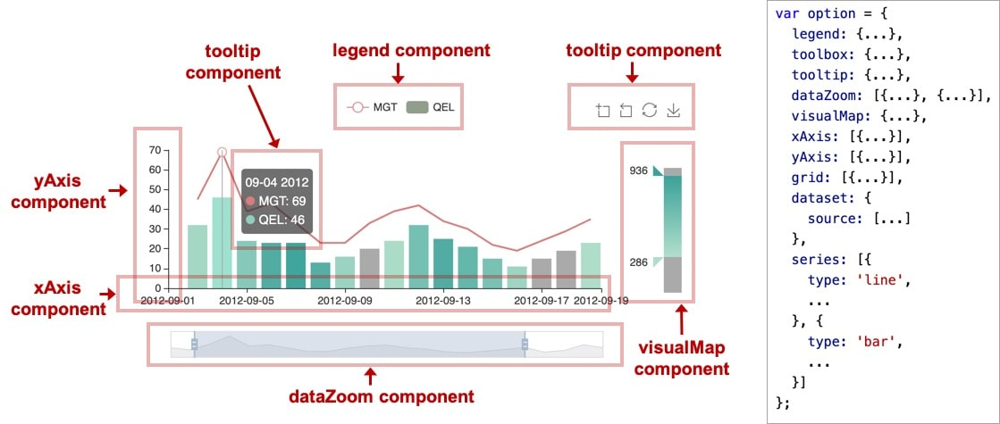
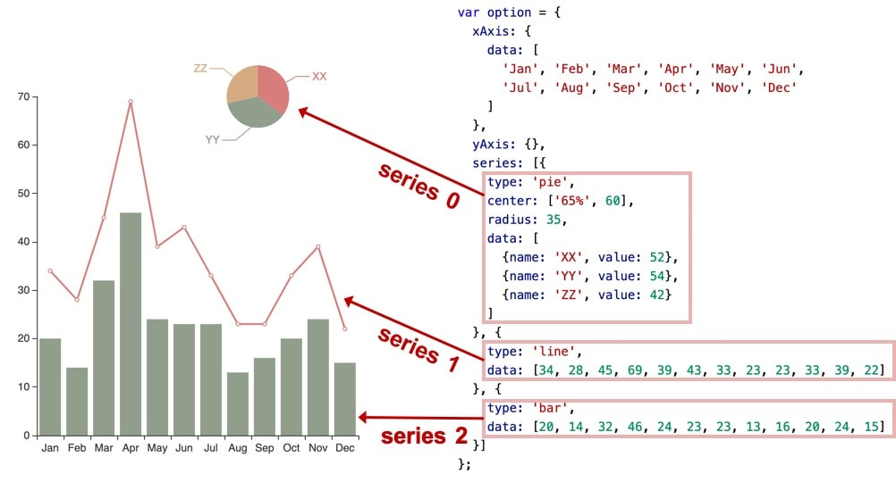
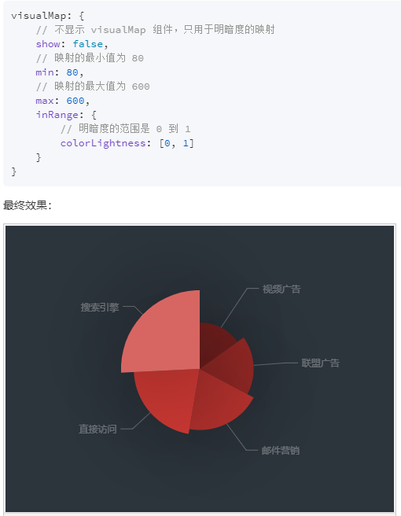

# ECharts 数据可视化 使用教程(图文版)----(2020.02.04, 成都)
## 武汉加油----冲鸭！！！

# 1. ECharts概述
## 1.1 ECharts介绍
- ECharts，一个使用 JavaScript 实现的开源可视化库，可以流畅的运行在 PC 和移动设备上，
- 兼容当前绝大部分浏览器（IE8/9/10/11，Chrome，Firefox，Safari等），
- 底层依赖矢量图形库 ZRender，提供直观，交互丰富，可高度个性化定制的数据可视化图表。

- 丰富的可视化类型
    - ECharts 提供了常规的折线图、柱状图、散点图、饼图、K线图，用于统计的盒形图，
    - 用于地理数据可视化的地图、热力图、线图，
    - 用于关系数据可视化的关系图、treemap、旭日图，
    - 多维数据可视化的平行坐标，还有用于 BI 的漏斗图，仪表盘，并且支持图与图之间的混搭。
    
- 除了已经内置的包含了丰富功能的图表，ECharts 还提供了自定义系列，只需要传入一个renderItem函数，
- 就可以从数据映射到任何你想要的图形，更棒的是这些都还能和已有的交互组件结合使用而不需要操心其它事情。
- 你可以在下载界面下载包含所有图表的构建文件，如果只是需要其中一两个图表，又嫌包含所有图表的构建文件太大，
- 也可以在在线构建中选择需要的图表类型后自定义构建。

## 1.2 安装使用
- 直接从 [GitHub](https://github.com/apache/incubator-echarts/releases) 下载整个项目文件，然后从echarts-4.6.0/dist 
    文件夹中获取构建好的 echarts，这都可以直接在浏览器端项目中使用。这些构建好的 echarts 提供了下面这几种定制：
- 完全版：echarts/dist/echarts.js，体积最大，包含所有的图表和组件，所包含内容参见：echarts/echarts.all.js。
- 常用版：echarts/dist/echarts.common.js，体积适中，包含常见的图表和组件，所包含内容参见：echarts/echarts.common.js。
- 精简版：echarts/dist/echarts.simple.js，体积较小，仅包含最常用的图表和组件，所包含内容参见：echarts/echarts.simple.js。
- 也可以使用在线引入地址,进入网址选择要引用的版本即可：http://www.bootcdn.cn/echarts/

## 1.3 ECharts语法
- ECharts语法和原生JS保持一致
- 所有键的值除了尺寸大小，值都要使用引号，键不用
- 键的名称都是原生JS一样的匈牙利命名风格，第一个单词小写，后面单词的首字母大写，比如
    - myChart、setOption、itemStyle
- 多个系列，先写一个列表，然后不同系列就是一个字典，所有字典放在列表中
- 参考下面图片


## 1.4 option配置组件设置 + 快速查询地址
- [术语速查手册,快速了解功能名称，帮助定位到配置项手册](https://www.echartsjs.com/zh/cheat-sheet.html)
- [配置项手册](https://www.echartsjs.com/zh/option.html#title)
- [GL配置项手册](https://www.echartsjs.com/zh/option-gl.html#globe)
- [API文档-常用内置方法接口](https://www.echartsjs.com/zh/api.html#echarts)

- 详细option配置快速查看寻找方法：
    - 第一步：打开[ECharts术语速查手册](https://www.echartsjs.com/zh/cheat-sheet.html)
    - 第二步：图表上面选择需要查询的组件，然后点击右边，查看配置项手册，就会跳转到option下组件详细配置页面
    
    - 第三步：进入配置详情页面，左边格式就是option标准写法，字典里面以键值的形式，值需要使用引号
    比如，title里面的text: '我是标题',空的''就是我们自己填的值，有值的就是还有其它值可以选择，title下面键的值还可以是字典
    比如，title下面的textStyle，用于设置文字颜色字体风格等
    
    - 第四步：option配置下面很多组件都是通用组件，如果要设置其它图形类型，需要进入series里面设置，里面有各种type类型，
    进入各种type里面可以详细设置每种图形的参数，比如折线图，绘制点的标记形状等
    
    

## 1.5 主题配置
- ECharts可以选择不同的主题，ECharts完整项目文件中有一个theme文件夹，里面有大量内置主题
- 但是默认只有dark和light可以直接在初始化实例时候使用
- 其它主题使用需要现引入主题的js文件，然后才能使用
- 参考案例010案例
- 也可以进入定制主题页面，自己定制调整后，然后下载js文件下来使用
- [在线主题下载及定制页面](https://www.echartsjs.com/zh/download-theme.html)

```javascript
// 主题使用代码示例
<script src="echarts.js"></script>

<!-- 引入 vintage 主题 -->
<script src="theme/vintage.js"></script>

<script>
// 第二个参数可以指定前面引入的主题
var chart = echarts.init(document.getElementById('main'), 'vintage');
chart.setOption({
    ...
});
</script>
```
- 主题样式选择


## 1.6 表格工具
- EXCEL表格可以快速转换为js、json、地理坐标等格式
[在线表格](https://www.echartsjs.com/zh/spreadsheet.html)


## 1.7 官方实例+用户分享实例
- ECharts快速绘图，可以直接复制官方实例或者用户实例代码到本地，一般代码都是option内容
- option直接复制到本地案例里面即可，注意jQuery、theme主题文件的引用

- [官方实例](https://www.echartsjs.com/examples/zh/index.html#chart-type-line)
    - 注意官方实例，右上角，可以选择三个主题样式，可以切换查看图的样式效果
    - ECharts默认就是第一个default，自带还可以选择在不引用主题文件下可以直接使用light和dark主题
    - 如果要使用其他theme文件夹中的主题，需要HTML文件开始引入主题的js文件，参考1.5 主题介绍
    
    
- [用户分享实例](https://gallery.echartsjs.com/explore.html#charts=map~sort=rank~timeframe=all~author=all)
    - 除了官方实例，每种图表类型下有大量用户分享的实例，可以直接复制下来使用
    - 用户分享实例可以自己进行筛选，右上角可以搜索名称，也可以搜索标签tags
    


# 2. ECharts基础概念概览
## 2.1 ECharts实例 
- 一个网页中可以创建多个 echarts 实例。
- 每个 echarts 实例 中可以创建多个图表和坐标系等等（用 option 来描述）。
- 准备一个 DOM 节点（作为 echarts 的渲染容器），就可以在上面创建一个 echarts 实例。
- 每个 echarts 实例独占一个 DOM 节点。
- 参考01文件夹中003案例


## 2.2 系列（series）
- 系列（series）是很常见的名词。
- 在 echarts 里，系列（series）是指：一组数值以及他们映射成的图。
- “系列”这个词原本可能来源于“一系列的数据”，而在 echarts 中取其扩展的概念，不仅表示数据，也表示数据映射成为的图。
- 所以，一个 系列 包含的要素至少有：一组数值、图表类型（series.type）、以及其他的关于这些数据如何映射成图的参数。
- echarts 里系列类型（series.type）就是图表类型。系列类型（series.type）至少有：
    - line（折线图）、bar（柱状图）、pie（饼图）、scatter（散点图）、graph（关系图）、tree（树图）、...
    - 如下图，右侧的 option 中声明了三个 系列（series）：pie（饼图系列）、line（折线图系列）、bar（柱状图系列），
    - 每个系列中有他所需要的数据（series.data）。
    
    

    
## 2.3 组件（component）
## 注意：图中的{...}里面的...是省略的具体设置参数

- 在系列之上，echarts 中各种内容，被抽象为“组件”。
- 例如，echarts 中至少有这些组件：
    - xAxis（直角坐标系 X 轴）、yAxis（直角坐标系 Y 轴）、
    - grid（直角坐标系底板）、angleAxis（极坐标系角度轴）、
    - radiusAxis（极坐标系半径轴）、polar（极坐标系底板）、
    - geo（地理坐标系）、dataZoom（数据区缩放组件）、
    - visualMap（视觉映射组件）、tooltip（提示框组件）、
    - toolbox（工具栏组件）、
    - series（系列）
- 我们注意到，其实系列（series）也是一种组件，可以理解为：系列是专门绘制“图”的组件。
- 如图，右侧的 option 中声明了各个组件（包括系列），各个组件就出现在图中。

- 注：因为系列是一种特殊的组件，所以有时候也会出现 “组件和系列” 这样的描述，这种语境下的 “组件” 是指：除了 “系列” 以外的其他组件。
- 组件就是option下的各种设置
- 组件里面有多个设置，每个设置都是一个字典，所有字典放在一个列表中，参考上面的图片，比如series

## 2.4 option 描述图表
- 上面已经出现了 option 这个概念。echarts 的使用者，使用 option 来描述其对图表的各种需求，
- 包括：有什么数据、要画什么图表、图表长什么样子、含有什么组件、组件能操作什么事情等等。
- 简而言之，option 表述了：数据、数据如何映射成图形、交互行为。


## 2.5 组件定位
- 多数组件和系列，都能够基于 top / right / down / left / width / height 绝对定位。 
- 这种绝对定位的方式，类似于 CSS 的绝对定位（position: absolute）。绝对定位基于的是 echarts 容器 DOM 节点。
- 其中，他们每个值都可以是：
    - 绝对数值（例如 bottom: 54 表示：距离 echarts 容器底边界 54 像素）。
    - 或者基于 echarts 容器高宽的百分比（例如 right: '20%' 表示：距离 echarts 容器右边界的距离是 echarts 容器高度的 20%）。
    - 如下图的例子，对 grid 组件（也就是直角坐标系的底板）设置 left、right、height、bottom 达到的效果。
    
- 可以注意到，left right width 是一组（横向）、top bottom height 是另一组（纵向）。这两组没有什么关联。
- 每组中，至多设置两项就可以了，第三项会被自动算出。例如，设置了 left 和 right 就可以了，width 会被自动算出。

- 补充：中心半径定位
    - 少数圆形的组件或系列，可以使用“中心半径定位”，例如，pie（饼图）、sunburst（旭日图）、polar（极坐标系）。
    - 中心半径定位，往往依据 center（中心）、radius（半径）来决定位置。

## 2.6 坐标系
- 很多系列，例如 line（折线图）、bar（柱状图）、scatter（散点图）、heatmap（热力图）等等，需要运行在 “坐标系” 上。
- 坐标系用于布局这些图，以及显示数据的刻度等等。
- 例如 echarts 中至少支持这些坐标系：直角坐标系、极坐标系、地理坐标系（GEO）、单轴坐标系、日历坐标系 等。
- 其他一些系列，例如 pie（饼图）、tree（树图）等等，并不依赖坐标系，能独立存在。
- 还有一些图，例如 graph（关系图）等，既能独立存在，也能布局在坐标系中，依据用户的设定而来。

- 一个坐标系，可能由多个组件协作而成。我们以最常见的直角坐标系来举例。
- 直角坐标系中，包括有 xAxis（直角坐标系 X 轴）、yAxis（直角坐标系 Y 轴）、grid（直角坐标系底板）三种组件。
- xAxis、yAxis 被 grid 自动引用并组织起来，共同工作。

- 我们来看下图，这是最简单的使用直角坐标系的方式：只声明了 xAxis、yAxis 和一个 scatter（散点图系列），
- echarts 暗自为他们创建了 grid 并关联起他们：


- 再来看下图，两个 yAxis，共享了一个 xAxis。两个 series，也共享了这个 xAxis，
- 但是分别使用不同的 yAxis，yAxis列表里面的一个字典就代表一个y轴，使用 yAxisIndex （y轴的索引）来指定它自己使用的是哪个 yAxis：


- 再来看下图，一个 echarts 实例中，有多个 grid，一个gird就是一张独立的图
- xAxis、yAxis、grid的列表里面的一个字典，就代表一个index，index就是索引，从0开始
- 每个 grid 分别有 xAxis、yAxis，他们使用 xAxisIndex、yAxisIndex、gridIndex 来指定引用关系：


# 3. 个性化图表样式
## 3.1 个性化图表样式介绍
- ECharts 提供了丰富的自定义配置选项，并且能够从全局、系列、数据三个层级去设置数据图形的样式。
- 画的是饼图，饼图主要是通过扇形的弧度表现不同类目的数据在总和中的占比，
- 它的数据格式比柱状图更简单，只有一维的数值，不需要给类目。因为不在直角坐标系上，所以也不需要xAxis，yAxis。
- 参考案例004

## 3.2 itemStyle个性化设置
- itemStyle个性化设置也是在option-->series里面配置
- ECharts 中有一些通用的样式，诸如阴影、透明度、颜色、边框颜色、边框宽度等，
- 这些样式一般都会在系列的 itemStyle 里设置。
- 例如阴影的样式可以通过下面几个配置项设置：
- 参考案例005

## 3.3 深色背景和浅色标签
- 把整个主题改成开始的示例中那样的深色主题，这就需要改背景色和文本颜色。
- 背景色是全局的，所以直接在 option 下设置 backgroundColor
- 文本的样式可以设置全局的,即 option 下设置 textStyle
- 也可以单独设置每个系列的label(标记，图例，类似曲线说明)，series里面每个系列内部单独设置[{label:{...}},{},...]。
- 参考series饼图里面的label设置：https://www.echartsjs.com/zh/option.html#series-pie.label
- 参考案例006/007

## 3.4 设置扇形的颜色、颜色映射明暗度
- ECharts 中每个扇形颜色的可以通过分别设置 data 下的数据项实现，数据后面接着设置itemStyle
- 只有明暗度的变化，所以有一种更快捷的方式是通过 visualMap 组件将数值的大小映射到明暗度。
- 参考案例008


# 4. ECharts样式
- 设置样式，改变图形元素或者文字的颜色、明暗、大小等。
- 四种设置方式：

## 4.1 颜色主题（Theme） 
- 最简单的更改全局样式的方式，是直接采用颜色主题（theme）
- 直接初始化chart实例时候指定：
    - var chart = echarts.init(dom, 'light');    浅色主题
    - var chart = echarts.init(dom, 'dark');     深色主题
- 下载主题文件，然后使用， UMD 格式的 JS 文件，支持了自注册，直接引入 JS 文件即可：
    - // 先在HTML 引入 vintage.js 文件后（假设主题名称是 "vintage"）
    - var chart = echarts.init(dom, 'vintage');

## 4.2 调色盘
- 调色盘，可以在 option 中设置。
- 它给定了一组颜色，图形、系列会自动从其中选择颜色。 
- 可以设置全局的调色盘，也可以设置系列自己专属的调色盘。
    
## 4.3 直接样式设置（itemStyle、lineStyle、areaStyle、label、...）
- 直接的样式设置是比较常用设置方式。‘
- 纵观 ECharts 的 option 中，很多地方可以设置 itemStyle、lineStyle、areaStyle、label 等等。
- 这些的地方可以直接设置图形元素的颜色、线宽、点的大小、标签的文字、标签的样式等等。

- 一般来说，ECharts 的各个系列和组件，都遵从这些命名习惯，
- 虽然不同图表和组件中，itemStyle、label 等可能出现在不同的地方。
    
- 高亮的样式设置（类似JS中鼠标hover后的状态,emphasis里面就是高亮后的状态）
    - 在鼠标悬浮到图形元素上时，一般会出现高亮的样式。
    - 默认情况下，高亮的样式是根据普通样式自动生成的。
    - 但是高亮的样式也可以自己定义，主要是通过 emphasis 属性来定制。
    - emphsis 中的结构，和普通样式的结构相同，
```javascript
option = {
    series: {
        type: 'scatter',

        // 普通样式。
        itemStyle: {
            // 点的颜色。
            color: 'red'
        },
        label: {
            show: true,
            // 标签的文字。
            formatter: 'This is a normal label.'
        },

        // 高亮样式。
        emphasis: {
            itemStyle: {
                // 高亮时点的颜色。
                color: 'blue'
            },
            label: {
                show: true,
                // 高亮时标签的文字。
                formatter: 'This is a emphasis label.'
            }
        }
    }
}
```

## 4.4 视觉映射（visualMap）
- 数据可视化是 数据 到 视觉元素 的映射过程（这个过程也可称为视觉编码，视觉元素也可称为视觉通道）。
- ECharts 的每种图表本身就内置了这种映射过程，
    - 比如折线图把数据映射到『线』，柱状图把数据映射到『长度』。
    - 一些更复杂的图表，如 graph、事件河流图、treemap 也都会做出他们内置的映射。
- 此外，ECharts 还提供了 visualMap 组件 来提供通用的视觉映射。
- visualMap 组件中可以使用的视觉元素有：
    - 图形类别（symbol）、图形大小（symbolSize）
    - 颜色（color）、透明度（opacity）、颜色透明度（colorAlpha）、
    - 颜色明暗度（colorLightness）、颜色饱和度（colorSaturation）、色调（colorHue）
    - 参考案例008，就是使用的颜色(红色)的明暗度

# 5. dataset管理数据
- ECharts 4 开始支持了 dataset 组件用于单独的数据集声明，
- 从而数据可以单独管理，被多个组件复用，并且可以基于数据指定数据到视觉的映射。
- ECharts 4 以前，数据只能声明在各个“系列（series）”中
- ECharts 4 提供了 数据集（dataset）组件来单独声明数据，它带来了这些效果：
    - 能够贴近这样的数据可视化常见思维方式：基于数据（dataset 组件来提供数据），指定数据到视觉的映射（由 encode 属性来指定映射），形成图表。
    - 数据和其他配置可以被分离开来，使用者相对便于进行单独管理，也省去了一些数据处理的步骤。
    - 数据可以被多个系列或者组件复用，对于大数据，不必为每个系列创建一份。
    - 支持更多的数据的常用格式，例如二维数组、对象数组等，一定程度上避免使用者为了数据格式而进行转换。
   
- dataset数据是默认按列，映射到图表
    - 如果没有给出这种映射配置，
    - 那么 ECharts 就按最常见的理解进行默认映射：X 坐标轴声明为类目轴，默认情况下会自动对应到 dataset.source 中的第一列；
    - 三个柱图系列，一一对应到 dataset.source 中后面每一列。
- 参考案例010

## 5.1 数据到图形的映射
- 指定 dataset 的列（column）还是行（row）映射为图形系列（series）。
    - 这件事可以使用 series.seriesLayoutBy 属性来配置。
    - 默认是按照列（column）来映射。
- 指定维度映射的规则：
    - 如何从 dataset 的维度（一个“维度”的意思是一行/列）映射到坐标轴（如 X、Y 轴）、
    - 提示框（tooltip）、标签（label）、图形元素大小颜色等（visualMap）。
    - 这件事可以使用 series.encode 属性，以及 visualMap 组件（如果有需要映射颜色大小等视觉维度的话）来配置。
- 按行作为数据映射参考案例011

## 5.2 维度（dimension）
- 介绍 encode 之前，首先要介绍“维度（dimension）”的概念。
    - 常用图表所描述的数据大部分是“二维表”结构，上述的011例子中，我们都使用二维数组来容纳二维表。
    - 现在，当我们把系列（series）对应到“列”的时候，那么每一列就称为一个“维度（dimension）”，而每一行称为数据项（item）。
    - 反之，如果我们把系列（series）对应到表行，那么每一行就是“维度（dimension）”，每一列就是数据项（item）。
- 维度可以有单独的名字，便于在图表中显示。维度名（dimension name）可以在定义在 dataset 的第一行（或者第一列）。
    - 例如上面的例子中，'product' 就是维度名。从第二行开始，才是正式的数据。
    - dataset.source 中第一行（列）到底包含不包含维度名，ECharts 默认会自动探测。
    - 当然也可以设置 dataset.sourceHeader: true 显示声明第一行（列）就是维度，
    - 或者 dataset.sourceHeader: false 表明第一行（列）开始就直接是数据。
- 大多数情况下，我们并不需要去设置维度类型，因为会自动判断。但是如果因为数据为空之类原因导致判断不足够准确时，可以手动设置维度类型。
- 数据到图形的映射（encode）参考案例012

## 5.3 ECharts默认的映射
- 值得一提的是，ECharts 针对最常见直角坐标系中的图表（折线图、柱状图、散点图、K线图等）、饼图、漏斗图，给出了简单的默认的映射，
- 从而不需要配置 encode 也可以出现图表（一旦给出了 encode，那么就不会采用默认映射）。默认的映射规则不易做得复杂，基本规则大体是：
    - 在坐标系中（如直角坐标系、极坐标系等）
        - 如果有类目轴（axis.type 为 'category'），则将第一列（行）映射到这个轴类目轴上，后续每一列（行）对应一个系列。
        - 如果没有类目轴，假如坐标系有两个轴（例如直角坐标系的 X Y 轴），则每两列对应一个系列，这两列分别映射到这两个轴上。
    - 如果没有坐标系（饼图）
        - 取第一列（行）为名字，第二列（行）为数值（如果只有一列，则取第一列为数值）。
    - 参考按011/012 指定了类目轴,第一行或者第一列就是类目轴
    - 案例013/014就是使用同一个数据dataset
    
# 6. 交互式组件--缩放组件
- 数据区域缩放组件（dataZoom）
- 『概览数据整体，按需关注数据细节』是数据可视化的基本交互需求。
- dataZoom 组件能够在直角坐标系（grid）、极坐标系（polar）中实现这一功能。
- dataZoom 组件现在支持几种子组件：
    - 内置型数据区域缩放组件（dataZoomInside）：内置于坐标系中。
    - 滑动条型数据区域缩放组件（dataZoomSlider）：有单独的滑动条操作。
    - 框选型数据区域缩放组件（dataZoomSelect）：全屏的选框进行数据区域缩放。入口和配置项均在 toolbox中。
    - 参考案例015
